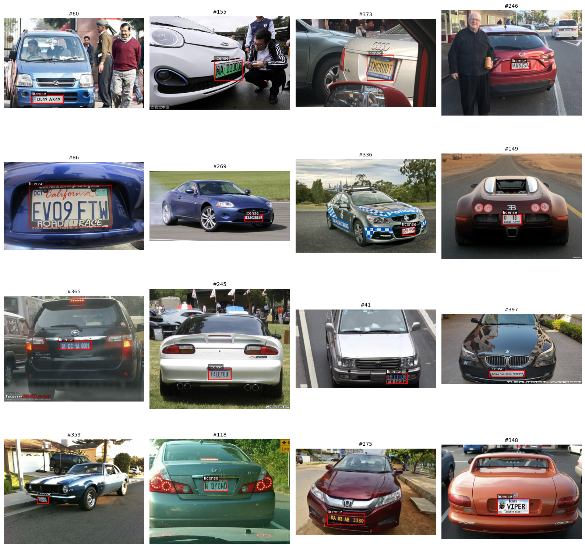
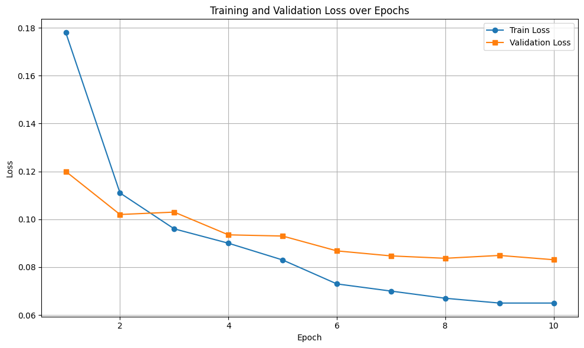
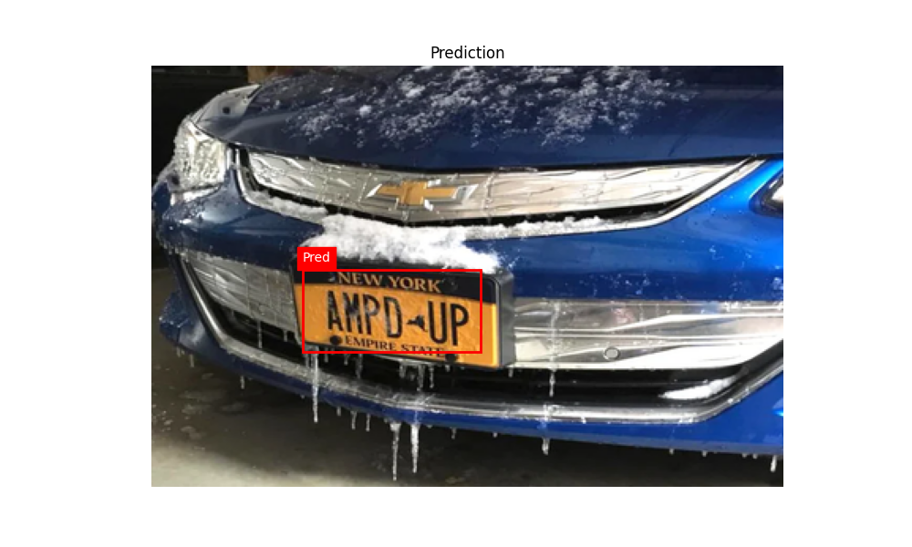

# 🚗 License Plate Detection using Faster R-CNN

A deep learning–based license plate detection system built using **PyTorch** and **Faster R-CNN**. Trained on a custom dataset with Pascal VOC-style `.xml` annotations to localize vehicle license plates in real-world images.

---

## 🔍 Project Overview

This project performs:
- Object detection for license plates in images
- Fine-tuning of a pretrained Faster R-CNN model
- OCR-ready bounding boxes as outputs
- Text extraction through Pytesseract

---

## 📁 Dataset

- Custom dataset in Pascal VOC XML format
- Contains labeled images of vehicles with license plates
- Training pipeline loads images and targets using a custom `Dataset` class

📸 Example Training Sample Set:

  

## 📉 Loss and 📈 Accuracy Curves

  

## 🔮 Sample Prediction on Test Set

  

---
